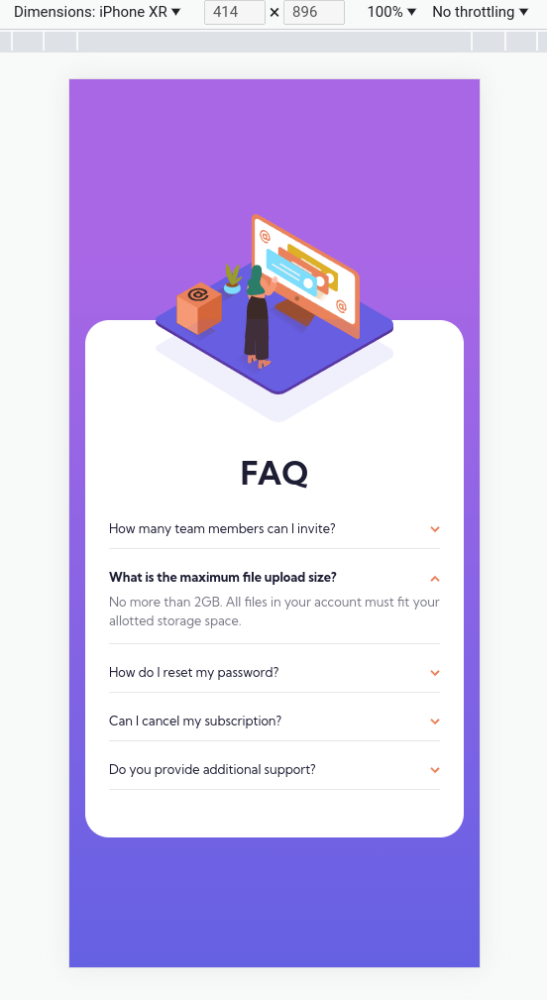

# Frontend Mentor - FAQ accordion card solution

This is a solution to the [FAQ accordion card challenge on Frontend Mentor](https://www.frontendmentor.io/challenges/faq-accordion-card-XlyjD0Oam). Frontend Mentor challenges help you improve your coding skills by building realistic projects.

## Table of contents

-   [Overview](#overview)
    -   [The challenge](#the-challenge)
    -   [Screenshot](#screenshot)
    -   [Links](#links)
-   [My process](#my-process)
    -   [Built with](#built-with)
    -   [What I learned](#what-i-learned)
    -   [Continued development](#continued-development)
    -   [Useful resources](#useful-resources)
-   [Author](#author)

## Overview

### The challenge

Users should be able to:

-   View the optimal layout for the component depending on their device's screen size
-   See hover states for all interactive elements on the page
-   Hide/Show the answer to a question when the question is clicked

### Screenshot

### Links

-   Solution URL: [Github](https://github.com/GabeGar/faq-accordion-component)
-   Live Site URL: [Gh-pages](https://gabegar.github.io/faq-accordion-component)

## My process

### Built with

-   [React](https://reactjs.org/) - JS library
-   [Vite](https://vitejs.dev)
-   Mobile-first workflow
-   Semantic HTML5 markup
-   Flexbox
-   CSS Grid
-   CSS custom properties

### What I learned

-   Positioning w/ position: (insert property value here) - was a little bit tricky for me, as I hadn't done it in a while. Served as a great refresher and reminded me, why it's an area of much needed improvement, on my end.

-   Reinforced conditional rendering, utilizing react. I'm aware of how to do it without javascript but wanted to implement the
    functionality of the according, in react, for more practice.

### Continued development

-   I struggled quite a bit with positioning the images in this project. Definitely need to work on this some more going forwards.

### Useful resources

-   [Blog by Thomas Sameshima](https://medium.com/@thomas.sameshima/css-overriding-the-parents-overflow-hidden-90c75a0e7296)
    -   Single handedly helped me overcome the positioning problem, where the desktop-box (containing the @ marking), wouldn't play nice with the overflow hidden property. Switched it to position sticky over absolute and got the job done.

## Author

-   Frontend Mentor - [@GabeGar](https://www.frontendmentor.io/profile/GabeGar)
